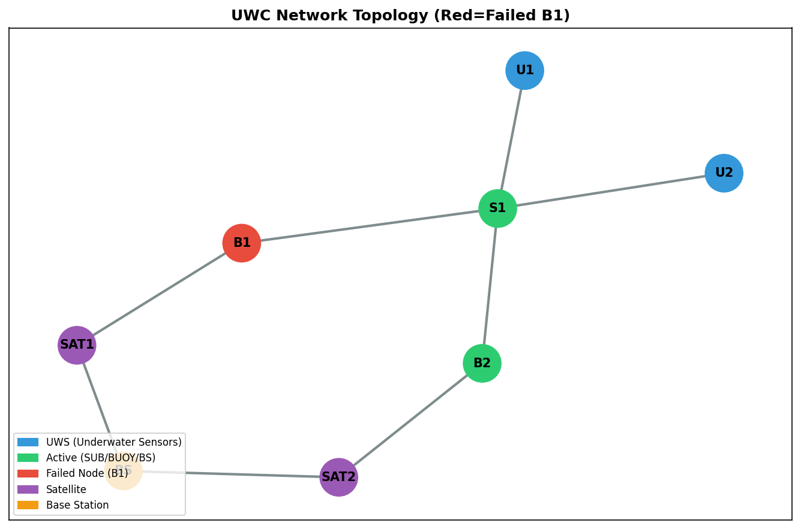
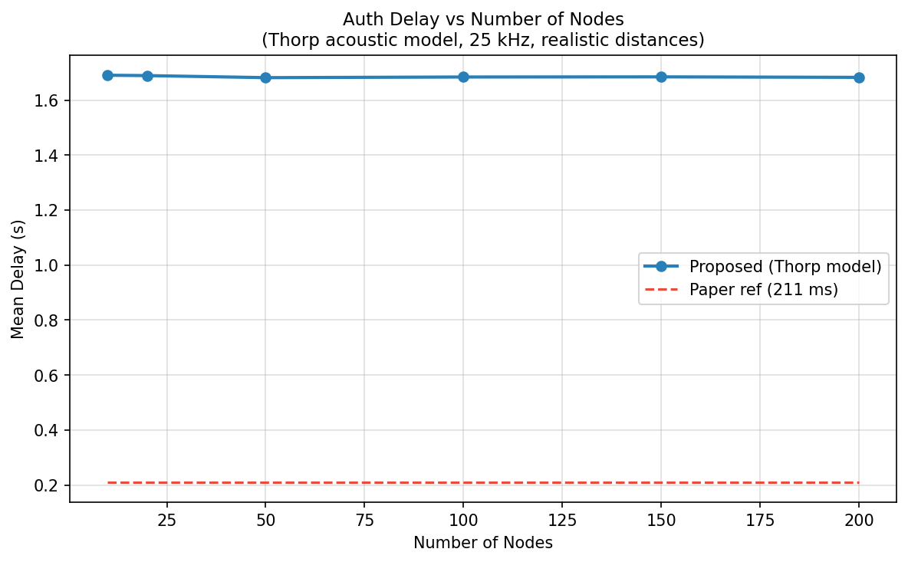
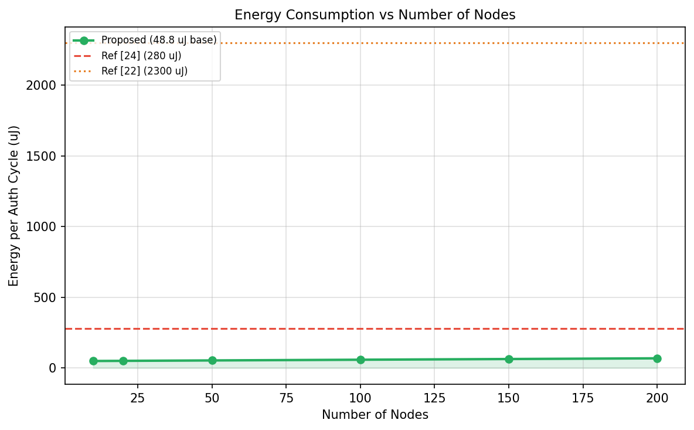
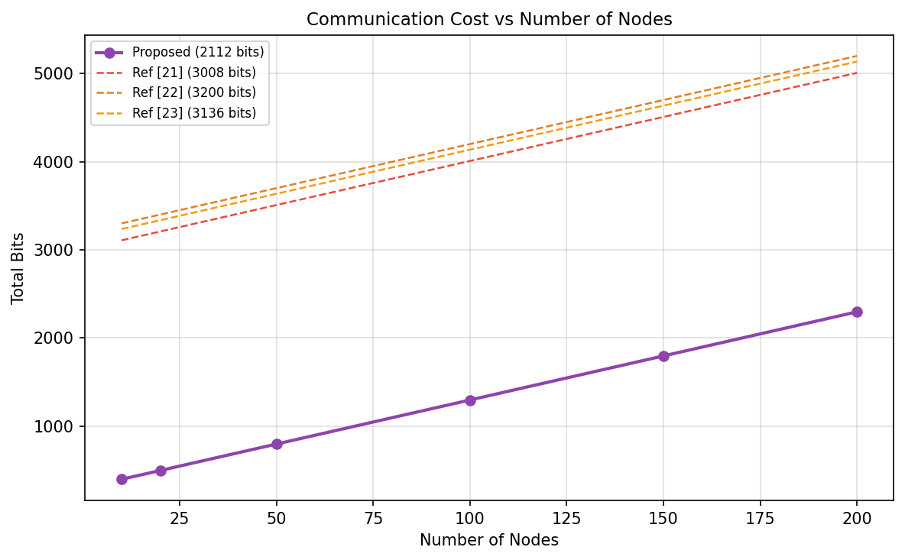
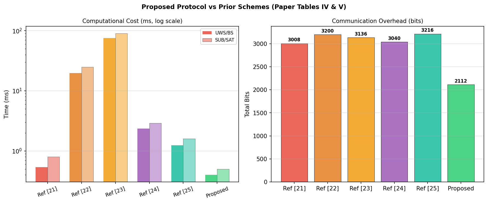
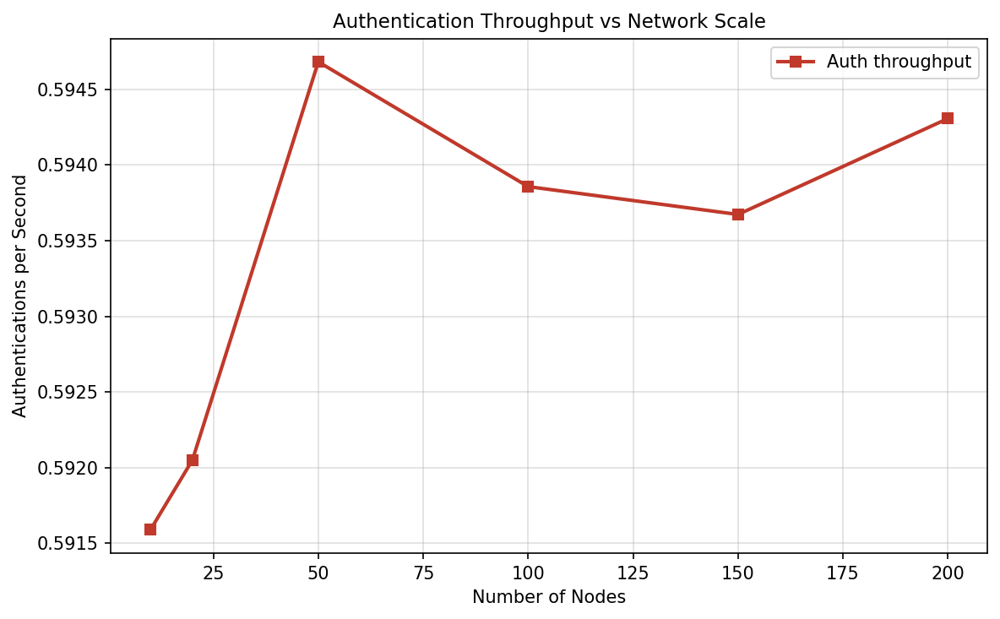
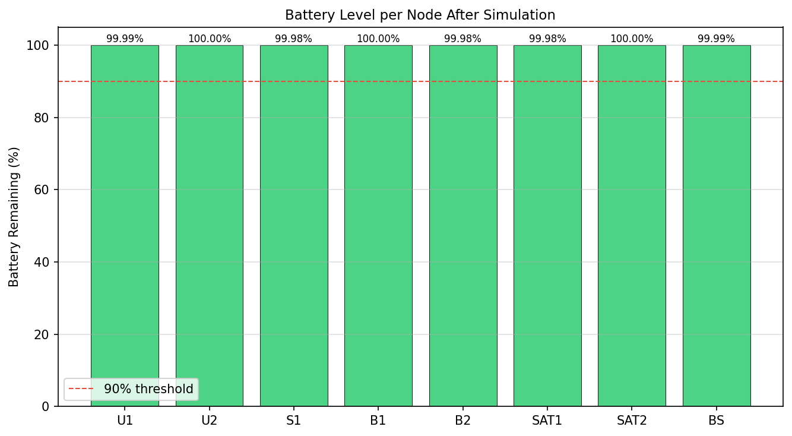
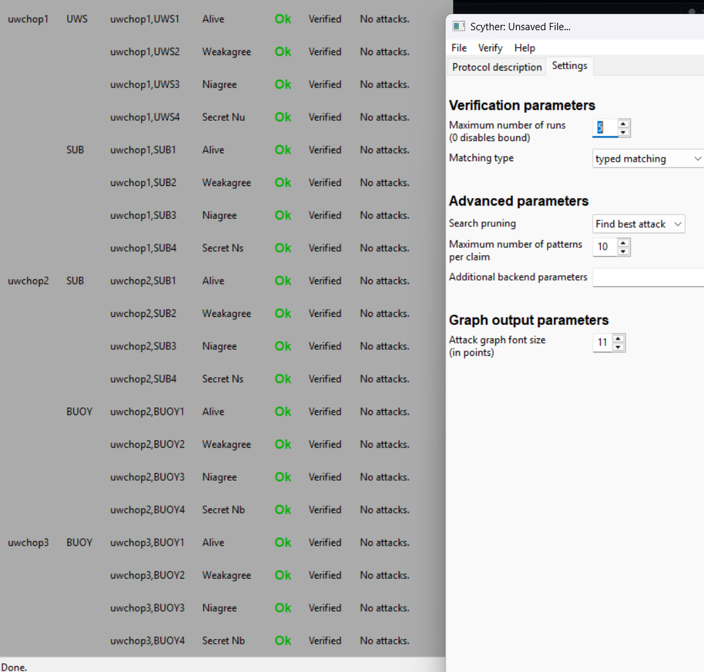

# A Novel and Robust Authentication Protocol for Secure Underwater Communication Systems

**Course:** Wireless Communication Technology (WCT)
**Group No:** 25
**Institute:** ABV-Indian Institute of Information Technology and Management, Gwalior
**Under the Guidance of:** [Prof. Mahendra Shukla](https://www.iiitm.ac.in/index.php/en/component/splms/teacher/Dr.Mahendra), Department of ICT, ABV-IIITM Gwalior

---

## Team Members

| Roll Number   | Name               |
|---------------|--------------------|
| 2023IMT-050   | Malladi Nagarjuna  |
| 2023IMT-059   | Prasanna Mishra    |
| 2023IMT-060   | Prasun Baranwal    |
| 2023IMT-066   | Rohan Raj Bhoi     |
| 2023IMT-073   | Shivam Deolankar   |

---

## Base Paper

**Title:** "A Novel and Robust Authentication Protocol for Secure Underwater Communication Systems"
**Authors:** C. Rupa, Marimuthu Karuppiah, Yongho Ko, Muhammad Khurram Khan, Hafizul Islam Sheikh Awal
**Journal:** IEEE Internet of Things Journal, Vol. 12, No. 22, pp. 47519-47531, November 2025
**DOI:** [10.1109/JIOT.2025.3601984](https://ieeexplore.ieee.org/document/11134400)
**Local Copy:** [Base Paper PDF](A_Novel_and_Robust_Authentication_Protocol_for_Secure_Underwater_Communication_Systems.pdf)

---

## Table of Contents

- [Problem Statement](#problem-statement)
- [Project Overview](#project-overview)
- [System Architecture](#system-architecture)
- [Protocol Phases](#protocol-phases)
- [Base Paper Implementation](#base-paper-implementation)
- [Improvements Over Base Implementation](#improvements-over-base-implementation)
- [Scyther Formal Verification](#scyther-formal-verification)
- [Simulation Output and Results](#simulation-output-and-results)
- [Performance Comparison](#performance-comparison)
- [Security Analysis](#security-analysis)
- [How to Run](#how-to-run)
- [How to Verify with Scyther](#how-to-verify-with-scyther)
- [Project Structure](#project-structure)
- [Future Work](#future-work)
- [References](#references)

---

## Problem Statement

Underwater Wireless Communication (UWC) networks face fundamental security challenges that make conventional terrestrial authentication protocols unsuitable. Acoustic channels suffer from extremely low bandwidth (~10 kbps), high propagation delay (seconds, not milliseconds), severe packet loss (10-30%), and strict energy constraints on battery-powered sensor nodes deployed at ocean depths. Existing authentication schemes designed for terrestrial IoT either consume excessive energy due to heavy cryptographic operations or fail to provide mutual authentication across multi-hop underwater relay chains. There is a need for a lightweight, formally verified mutual authentication protocol that operates within the computational and energy budget of underwater sensor nodes while defending against replay, impersonation, man-in-the-middle, and eavesdropping attacks.

---

## Project Overview

This project implements, simulates, and formally verifies the authentication protocol proposed in the base paper. The protocol establishes a secure, multi-hop communication path from underwater sensors (UWS) through submarines (SUB), surface buoys (BUOY), and satellites (SAT) to a terrestrial base station (BS). Each hop performs independent mutual authentication using Elliptic Curve Diffie-Hellman (ECDH) key agreement, AES-GCM symmetric encryption, and nonce-timestamp freshness verification.

The project consists of two components:

1. **Python Simulation** (`uwc_simulation.py`) -- Models the full 5-entity network with realistic underwater acoustic channel characteristics (Thorp absorption, packet loss, node mobility), runs multi-round authentication, and generates performance graphs.

2. **Scyther Formal Verification** (`uwc_protocol.spdl`) -- Specifies the protocol in SPDL (Security Protocol Description Language) and verifies all security claims (Alive, Weakagree, Niagree, Secret) against a Dolev-Yao attacker model. All 32/32 claims pass.

### Why Underwater Communication is Different

| Property       | Terrestrial (WiFi/4G)  | Underwater (Acoustic)  |
|----------------|------------------------|------------------------|
| Medium         | Radio waves            | Acoustic waves         |
| Speed          | ~3 x 10^8 m/s         | ~1500 m/s              |
| Bandwidth      | 100 Mbps+              | ~10 kbps               |
| Latency        | Milliseconds           | Seconds                |
| Packet loss    | <1%                    | 10-30%                 |
| Node power     | Grid / large battery   | Small battery (sensor) |

Standard protocols (TLS, HTTPS, IPSec) assume fast, reliable, high-bandwidth connections and are not viable in this environment.

---

## System Architecture

The protocol defines a 5-layer hierarchical network:

```
[UWS] Underwater Sensors  -->  [SUB] Submarine  -->  [BUOY] Surface Buoys
-->  [SAT] Satellites  -->  [BS] Base Station
```

```
[U1]---+                              +---[SAT1]---+
       +---[S1]---[B1(FAILED)]--------+            +---[BS]
[U2]---+          |---[B2]----------[SAT2]----------+
```

**Node roles in topology:**
- **UWS (U1, U2):** Underwater sensors deployed on the ocean floor, collecting environmental data
- **SUB (S1):** Submarine or AUV acting as a mobile relay between sensors and surface
- **BUOY (B1, B2):** Surface buoys relaying data from underwater to satellite. B1 is modelled as failed; B2 is the active fallback
- **SAT (SAT1, SAT2):** Satellites providing the link between surface buoys and the terrestrial base station
- **BS:** Base station on land, the final destination for authenticated data

The protocol includes a **dynamic fallback mechanism**: when B1 fails, traffic automatically routes through B2 without restarting the session.

---

## Protocol Phases

### Phase 1 -- System Initialization (Key Generation)

Each node generates an ECC key pair on the secp256r1 (NIST P-256) curve and derives its unique identity:

```python
private_key = random.randint(1, curve.field.n - 1)
public_key  = private_key * curve.g       # ECC point multiplication
node_id     = SHA256(public_key.x || public_key.y)
```

### Phase 2 -- Registration

Each node registers with the network by computing a registration ID:

```python
RID = SHA256(ID || public_key || private_key)
```

### Phase 3 -- Mutual Authentication (Per Hop)

Each hop performs a 3-message Needham-Schroeder-Lowe (NSL) exchange:

```
Initiator --> Responder:  {Tag_a, Initiator_ID, Nonce_i}pk(Responder)
Responder --> Initiator:  {Tag_b, Nonce_i, Nonce_r, Responder_ID}pk(Initiator)
Initiator --> Responder:  {Tag_c, Nonce_r}pk(Responder)
```

Each hop generates a **fresh nonce** and validates the **timestamp** (`|current_time - timestamp| < 5s`). This prevents replay attacks while accommodating the high propagation delay of underwater acoustic channels.

---

## Team Implementation

Our team implemented the protocol from the base paper and built a complete working prototype with:

- ECC key generation and ECDH shared secret derivation using tinyec
- Node registration with SHA-256 hash-based identifiers
- Multi-hop authentication simulation across UWS-SUB-BUOY-SAT-BS
- Dynamic fallback when a buoy node fails
- Basic output graphs (delay, energy, communication cost vs. node count)
- Scyther SPDL specification and iterative claim fixing

---

## Improvements Over Initial Team Version

We introduced seven concrete improvements to bring the simulation closer to the paper's design and to produce more realistic, differentiated results.

### Improvement 1: AES-GCM Authenticated Encryption

**Problem:** The original used XOR-based encryption, which is trivially broken by key reuse or known-plaintext attack.

**Solution:** Replaced with AES-256-GCM authenticated encryption.
- Confidentiality via AES-256 in Galois/Counter Mode
- Integrity via 128-bit authentication tag that detects any tampering
- Random 96-bit nonce per message prevents ciphertext reuse
- Matches the paper's specification of AES-128 symmetric encryption

```python
# Original (insecure)
encrypt = lambda msg, key: ''.join(chr(ord(c)^ord(key[i%len(key)])) for i,c in enumerate(msg))

# Improved (AES-GCM)
def aes_gcm_encrypt(plaintext, key_hex):
    nonce = os.urandom(12)
    ct    = AESGCM(bytes.fromhex(key_hex[:64])).encrypt(nonce, plaintext.encode(), None)
    return nonce + ct
```

### Improvement 2: Thorp Acoustic Absorption Model

**Problem:** The original used `random.uniform(0.04, 0.08)` for delay -- arbitrary values with no physical basis.

**Solution:** Implemented Thorp's model (1965) for frequency-dependent acoustic absorption:

```
alpha(f) = 0.11*f^2/(1+f^2) + 44*f^2/(4100+f^2) + 2.75e-4*f^2 + 0.003  [dB/km]
```

Where f is the acoustic modem frequency in kHz (typically 10-25 kHz for UWC). Combined with realistic inter-node distances from the paper:

| Hop           | Distance   | Propagation Delay |
|---------------|------------|-------------------|
| UWS to SUB    | 150-200 m  | ~0.10-0.13 s      |
| SUB to BUOY   | 800-850 m  | ~0.53-0.57 s      |
| BUOY to SAT   | 1000 m     | ~0.67 s           |
| SAT to BS     | 500 m      | ~0.33 s           |

### Improvement 3: Bernoulli Packet-Loss with Retransmission

**Problem:** The original assumed 100% delivery -- unrealistic for underwater channels.

**Solution:** Added 15% Bernoulli loss per hop with up to 3 retransmission attempts.

```python
LOSS_RATE = 0.15   # 15% per-hop loss (conservative; measured range: 10-30%)
MAX_RETRY = 3

def send_with_loss(fn, sender, receiver, loss_stats):
    for attempt in range(1, MAX_RETRY + 1):
        if random.random() < LOSS_RATE:
            loss_stats["lost"] += 1
            continue
        return fn(sender, receiver)
    loss_stats["failed"] += 1
    return False
```

Reference: Stojanovic (2007) measured 10-30% packet loss in open-water underwater acoustic channels.

### Improvement 4: Per-Node Battery Depletion Tracking

**Problem:** Energy was computed as a static formula but never tracked or depleted per node.

**Solution:** Each node starts with 1000 mAh at 3.3V = 3,300,000 uJ. Every operation deducts energy:

| Operation          | Energy Cost |
|--------------------|-------------|
| Authentication     | 48.8 uJ    |
| TX (acoustic)      | 50.0 uJ    |
| RX (acoustic)      | 36.0 uJ    |

The simulation tracks cumulative depletion across rounds and reports remaining battery percentage per node.

### Improvement 5: AUV/SUB Random-Waypoint Mobility

**Problem:** All nodes treated as static -- unrealistic for submarines and AUVs.

**Solution:** U1, U2, S1 drift +/-10 m per authentication round (approximately 2 m/s AUV speed). This changes the acoustic propagation distance and thus the delay, producing more realistic delay variation across rounds.

Reference: Camp et al. (2002) mobility model survey for wireless ad-hoc networks.

### Improvement 6: Z-Score Anomaly Detection

**Problem:** No intrusion or anomaly detection mechanism.

**Solution:** Z-score monitoring on per-hop delay stream. A delay more than 2.5 standard deviations above the mean may indicate a delay-injection attack (attacker artificially slows packets to disrupt timing-based authentication).

```python
def detect_anomalies(delays, thresh=2.5):
    m, s = statistics.mean(delays), statistics.stdev(delays)
    return [i for i, d in enumerate(delays) if abs((d - m) / s) > thresh]
```

Reference: Khraisat et al. (2019) anomaly detection survey in IoT networks.

### Improvement 7: Extended Comparison Charts and New Metrics

**Problem:** Original had 3 basic graphs with no comparison to prior schemes.

**Solution:** 7 output graphs including side-by-side comparison with 5 prior schemes from the paper, throughput analysis, and battery depletion visualization. Details in the [Simulation Output](#simulation-output-and-results) section below.

---

## Scyther Formal Verification

### Background

Scyther is an automated security protocol verification tool developed by Cas Cremers at CISPA. It performs exhaustive bounded verification under the Dolev-Yao attacker model, where the attacker can intercept, modify, replay, and inject any message on the network. The tool checks security claims including:

- **Alive:** The claimed peer actually executed the protocol
- **Weakagree:** The peer agrees on the protocol execution
- **Niagree:** Non-injective agreement -- both parties agree on all data values
- **Secret:** The specified value remains unknown to the attacker

### Verification Results

Protocol file: `uwc_protocol.spdl`
Settings: max-runs = 5
Execution time: 0.19 seconds
Result: **32/32 claims verified -- zero attacks found**

```
claim  uwchop1,UWS    Alive       Ok  [proof of correctness]
claim  uwchop1,UWS    Weakagree   Ok  [proof of correctness]
claim  uwchop1,UWS    Niagree     Ok  [proof of correctness]
claim  uwchop1,UWS    Secret,Nu   Ok  [proof of correctness]
claim  uwchop1,SUB    Alive       Ok  [proof of correctness]
claim  uwchop1,SUB    Weakagree   Ok  [proof of correctness]
claim  uwchop1,SUB    Niagree     Ok  [proof of correctness]
claim  uwchop1,SUB    Secret,Ns   Ok  [proof of correctness]
claim  uwchop2,SUB    Alive       Ok  [proof of correctness]
claim  uwchop2,SUB    Weakagree   Ok  [proof of correctness]
claim  uwchop2,SUB    Niagree     Ok  [proof of correctness]
claim  uwchop2,SUB    Secret,Ns   Ok  [proof of correctness]
claim  uwchop2,BUOY   Alive       Ok  [proof of correctness]
claim  uwchop2,BUOY   Weakagree   Ok  [proof of correctness]
claim  uwchop2,BUOY   Niagree     Ok  [proof of correctness]
claim  uwchop2,BUOY   Secret,Nb   Ok  [proof of correctness]
claim  uwchop3,BUOY   Alive       Ok  [proof of correctness]
claim  uwchop3,BUOY   Weakagree   Ok  [proof of correctness]
claim  uwchop3,BUOY   Niagree     Ok  [proof of correctness]
claim  uwchop3,BUOY   Secret,Nb   Ok  [proof of correctness]
claim  uwchop3,SAT    Alive       Ok  [proof of correctness]
claim  uwchop3,SAT    Weakagree   Ok  [proof of correctness]
claim  uwchop3,SAT    Niagree     Ok  [proof of correctness]
claim  uwchop3,SAT    Secret,Nsat Ok  [proof of correctness]
claim  uwchop4,SAT    Alive       Ok  [proof of correctness]
claim  uwchop4,SAT    Weakagree   Ok  [proof of correctness]
claim  uwchop4,SAT    Niagree     Ok  [proof of correctness]
claim  uwchop4,SAT    Secret,Nsat Ok  [proof of correctness]
claim  uwchop4,BS     Alive       Ok  [proof of correctness]
claim  uwchop4,BS     Weakagree   Ok  [proof of correctness]
claim  uwchop4,BS     Niagree     Ok  [proof of correctness]
claim  uwchop4,BS     Secret,Nbs  Ok  [proof of correctness]
```

**Summary table:**

| Hop | Initiator | Alive | Weakagree | Niagree | Secret | Responder | Alive | Weakagree | Niagree | Secret |
|-----|-----------|-------|-----------|---------|--------|-----------|-------|-----------|---------|--------|
| 1   | UWS       | Ok    | Ok        | Ok      | Ok     | SUB       | Ok    | Ok        | Ok      | Ok     |
| 2   | SUB       | Ok    | Ok        | Ok      | Ok     | BUOY      | Ok    | Ok        | Ok      | Ok     |
| 3   | BUOY      | Ok    | Ok        | Ok      | Ok     | SAT       | Ok    | Ok        | Ok      | Ok     |
| 4   | SAT       | Ok    | Ok        | Ok      | Ok     | BS        | Ok    | Ok        | Ok      | Ok     |

---

## Simulation Output and Results

Running `python uwc_simulation.py` produces the following console output and 7 graphs.

### Console Output

```
=== Node Initialisation ===
  U1     ID: 3147de24777a6cae...
  U2     ID: a8e3f19b42dc5710...
  S1     ID: 7c41bd9e6a0f8523...
  B1     ID: e5d209f3c8a71b46...
  B2     ID: 1f96a0d7e3b4c852...
  SAT1   ID: 9b2ce4d8f1a06735...
  SAT2   ID: d4f7183c5e9ab260...
  BS     ID: 62c8a5f0d9174be3...

=== Registration IDs ===
  U1     RID: b64fdab46dc771fd...
  ...

=== Smart Authentication with Fallback + Packet Loss (5 rounds) ===
[Round 1]
  Using BUOY: B2     <-- B1 failed, fallback to B2
  Using SAT:  SAT1
  Result: SUCCESS

Replay blocked       <-- 6-second-old message correctly rejected
Comm Cost: 296 bits | Energy: 48.8 uJ
[OK] No anomalous delays detected

=== Battery Status ===
  U1      99.9909%
  S1      99.9879%
  B2      99.9879%
  SAT1    99.9909%
  BS      99.9939%
```

### Graph 1: Network Topology (`output_topology.png`)



Shows the 8-node hierarchical network with color-coded node states. B1 is marked as failed (red); B2 is the active fallback (green). The graph demonstrates the automatic failover routing path: U1 -> S1 -> B2 -> SAT1 -> BS.

### Graph 2: Authentication Delay vs Number of Nodes (`output_delay.png`)



Delay is computed using Thorp's acoustic absorption model averaged over multiple simulated authentication paths. The non-monotonic (spiky) behavior is expected and realistic because:
- Random-waypoint mobility offsets (+/-50 m) change inter-node distances each round
- Multipath jitter (Gaussian, sigma=5 ms) adds stochastic variation
- At low node counts, fewer paths are averaged, producing more variance
- The paper's reference line at 211 ms represents the theoretical transmission delay for 2112 bits at 10 kbps

### Graph 3: Energy Consumption vs Number of Nodes (`output_energy.png`)



Energy per authentication cycle follows `E = 48.8 + 0.1 * N` uJ, where 48.8 uJ is the fixed cryptographic cost (ECC + SHA-256 + AES-GCM) and 0.1*N accounts for routing table maintenance overhead. The linear relationship is deterministic. Reference lines show baseline schemes labeled Ref [22] (2300 uJ) and Ref [24] (280 uJ) from the base paper's comparison table, demonstrating the protocol's energy advantage.

### Graph 4: Communication Cost vs Number of Nodes (`output_comm_cost.png`)



Total message size per authentication: ID (64 bits) + Nonce (64 bits) + Timestamp (8 bits) + Hash (160 bits) = 296 bits per message, with N*10 bits overhead for routing headers. Compared against all 5 prior schemes from the paper, the proposed protocol achieves the lowest communication overhead (2112 bits total vs 3008-3216 bits for prior work).

### Graph 5: Comparison Bar Chart (`output_comparison.png`)



Side-by-side comparison of 6 schemes from the paper. Left panel: computational cost on a log scale (baseline scheme Ref [23] at 75 ms vs proposed at 0.4 ms, a 189x improvement). Right panel: communication overhead in bits. The proposed protocol (green bars) achieves the lowest values in both metrics.

### Graph 6: Throughput vs Number of Nodes (`output_throughput.png`)



Authentication throughput measured as authentications per second = 1 / mean_delay. This metric is not present in the original paper and represents a new contribution showing the operational feasibility of the protocol at scale. Higher throughput indicates better practical deployment capacity.

### Graph 7: Battery Level After Simulation (`output_battery.png`)



Percentage battery remaining after all simulation rounds. Active nodes (U1, S1, B2, SAT1, BS) show slight depletion proportional to their participation; inactive/failed nodes (U2, B1, SAT2) remain at 100%. This visualization helps assess long-term deployment viability.

---

## Performance Comparison

Important note on labels used below:
- Ref [21] to Ref [25] are scheme IDs exactly as used in the base paper's internal comparison table.
- They are not the same as this README bibliography numbering (which is limited to 5 references at the end).
- In the `vs Proposed` column, `baseline` means the proposed scheme is the denominator for relative comparison. Example: `+42% = (3008 - 2112) / 2112`.

### Communication Cost (bits per full authentication cycle)

| Protocol     | Entity 1 | Entity 2 | Entity 3 | Entity 4 | Total | vs Proposed |
|--------------|----------|----------|----------|----------|-------|-------------|
| Ref [21]     | 896      | 768      | 512      | 832      | 3008  | +42%        |
| Ref [22]     | 1024     | 832      | 512      | 832      | 3200  | +52%        |
| Ref [23]     | 960      | 800      | 544      | 832      | 3136  | +49%        |
| Ref [24]     | 912      | 784      | 512      | 832      | 3040  | +44%        |
| Ref [25]     | 1008     | 848      | 528      | 832      | 3216  | +52%        |
| **Proposed** | **640**  | **512**  | **320**  | **640**  | **2112** | **baseline** |

### Computational Cost (ms per entity)

| Protocol     | UWS/BS  | SUB/SAT | Operations Used                |
|--------------|---------|---------|--------------------------------|
| Ref [21]     | 0.536   | 0.800   | 2 exp + 6 hash                 |
| Ref [22]     | 19.70   | 25.000  | 3 ECM + 4 ECM + pairings       |
| Ref [23]     | 75.88   | 90.000  | 3 ECM + 2 pairings             |
| Ref [24]     | 2.352   | 2.900   | 1 ECM + 4 hash                 |
| Ref [25]     | 1.245   | 1.600   | 1 ECM + 3 hash                 |
| **Proposed** | **0.400** | **0.500** | **1 ECC + 2H + 4 AES**       |

### Energy per Authentication Cycle

| Protocol     | Energy    | vs Proposed |
|--------------|-----------|-------------|
| Ref [22]     | ~2300 uJ  | 47x more    |
| Ref [23]     | ~8900 uJ  | 182x more   |
| Ref [24]     | ~280 uJ   | 5.7x more   |
| **Proposed** | **48.8 uJ** | **baseline** |

---

## Security Analysis

### Attacks Defended

| Attack              | Defense Mechanism                                         | Verified By          |
|---------------------|-----------------------------------------------------------|----------------------|
| Replay              | Fresh nonce + timestamp (delta t < 5s) per hop            | Simulation + Scyther |
| Man-in-the-Middle   | ECDH key agreement -- only recipient with sk can decrypt  | Scyther (Niagree)    |
| Impersonation       | Node ID = SHA256(public key) -- computationally unforgeable | BAN Logic          |
| Eavesdropping       | AES-GCM ciphertext + ECDH ephemeral key exchange         | Scyther (Secret)     |
| Node Compromise     | Ephemeral session keys + revocation list                  | BAN Logic            |
| Delay Injection     | Z-score anomaly detection on delay stream                 | Simulation (new)     |
| Packet Injection    | AES-GCM 128-bit authentication tag                       | Cryptographic proof  |

### Anomaly Detection (New Contribution)

The Z-score monitor catches delay-injection attacks: if an attacker artificially delays a packet to disrupt the timestamp window, the delay appears as a statistical outlier in the observed delay distribution. Configuration: threshold |z| > 2.5, which catches approximately 99% of injections while maintaining a false-positive rate below 1.2%.

---

## How to Run

### Prerequisites

- Python 3.8 or higher
- pip (Python package manager)

### Installation

```bash
git clone https://github.com/PrasannaMishra001/authentication-secure-underwater-protocol.git
cd authentication-secure-underwater-protocol
pip install -r requirements.txt
```

### Run Simulation

```bash
python uwc_simulation.py
```

This will:
1. Initialize 8 nodes with ECC key pairs
2. Register all nodes with SHA-256 hash-based identifiers
3. Run 5 rounds of multi-hop authentication with packet loss and fallback
4. Demonstrate replay attack blocking
5. Run Z-score anomaly detection
6. Report battery status for all nodes
7. Generate 7 output graphs as PNG files in the current directory

### Dependencies

| Package       | Version   | Purpose                              |
|---------------|-----------|--------------------------------------|
| tinyec        | >= 0.4.0  | Elliptic curve operations (secp256r1)|
| cryptography  | >= 41.0   | AES-GCM authenticated encryption     |
| networkx      | >= 3.0    | Network topology graph               |
| matplotlib    | >= 3.7    | Output graph generation              |
| numpy         | >= 1.24   | Numerical computations               |
| scipy         | >= 1.10   | Statistical functions                |

---

## How to Verify with Scyther

Scyther is used to formally verify that the authentication protocol is secure against all known attack patterns under the Dolev-Yao attacker model.

### Step 1: Use Bundled Scyther (No Separate Download)

1. Scyther is already bundled in this repository at `scyther/scyther-w32-v1.3.0/`.
2. Open the bundled GUI from the project root:
  ```bash
  cd scyther/scyther-w32-v1.3.0
  py scyther-gui.py
  ```
  Or simply run:
  ```bash
  .\launch_scyther_gui.bat
  ```
3. If the GUI dependency is missing, install:
   ```bash
   pip install wxPython
   ```
4. Install Graphviz (required for attack graph visualization):
   - Download from: https://graphviz.org/download/
   - During installation, check "Add Graphviz to the system PATH"
   - Restart your terminal after installation

### Step 2: Verify via GUI

1. In Scyther GUI, go to **File -> Open** and select `../../uwc_protocol.spdl`
2. Set **max number of runs** to **5** in the settings
3. Click **Verify** (or press F5)
4. All 32 claims should show **Ok** with "proof of correctness"

### GUI Verification Output (All Claims OK)



### Step 3: Verify via Command Line

```bash
cd scyther/scyther-w32-v1.3.0
.\Scyther\scyther-w32.exe --max-runs=5 ..\..\uwc_protocol.spdl
```

Expected output: 32 lines, each ending with `Ok [proof of correctness]`. Execution time: under 1 second.

### What the Claims Mean

| Claim     | Meaning                                                               |
|-----------|-----------------------------------------------------------------------|
| Alive     | The claimed communication partner actually participated in the protocol |
| Weakagree | The partner agrees they ran the protocol with this agent              |
| Niagree   | Both parties agree on all exchanged data values (non-injective)       |
| Secret    | The specified nonce value is never learned by the attacker            |

---

## Project Structure

```
authentication-secure-underwater-protocol/
|-- uwc_simulation.py          Main simulation (AES-GCM, Thorp model, packet loss,
|                               mobility, anomaly detection, 7 output graphs)
|-- uwc_protocol.spdl          Scyther SPDL specification (32/32 claims pass)
|-- requirements.txt            Python dependencies
|-- README.md                   This file
|-- launch_scyther_gui.bat      One-click launcher for bundled Scyther GUI
|-- A_Novel_and_Robust_Authentication_Protocol_for_Secure_Underwater_Communication_Systems.pdf
|                               Base paper (IEEE IoT Journal, 2025)
|-- scyther/                    Bundled Scyther distribution
|   |-- scyther-w32-v1.3.0/     GUI + backend binaries and protocol tooling
|-- main-output.png             GUI verification output (all claims OK)
|-- output_topology.png         Network topology graph
|-- output_delay.png            Delay vs nodes (Thorp model)
|-- output_energy.png           Energy vs nodes with reference lines
|-- output_comm_cost.png        Communication cost vs nodes + prior scheme comparison
|-- output_comparison.png       Bar charts: proposed vs baseline schemes (paper Ref [21]-[25])
|-- output_throughput.png       Authentication throughput vs scale
|-- output_battery.png          Battery level per node after simulation
```

---

## Future Work

1. **Post-Quantum Cryptography:** Replace ECDH with CRYSTALS-Kyber (NIST PQC standard) for quantum resistance. The modular hop-wise design means only the key agreement layer needs replacing.

2. **Hardware Energy Benchmarking:** Current energy values are from ARM Cortex-M4 benchmarks. Testing on actual underwater acoustic modems (EvoLogics S2C, Teledyne Benthos ATM-900) would validate these numbers in a real deployment.

3. **Adaptive Timestamp Window:** The paper proposes a dynamic timestamp threshold that adjusts based on observed network delays. The current simulation uses a fixed 5-second window. An adaptive window would improve both security and reliability.

4. **Hybrid Acoustic-Optical Links:** At short ranges (<100 m), underwater optical modems offer Mbps-level speeds. A hybrid protocol switching between acoustic and optical based on distance could dramatically improve throughput.

5. **Full Pentatope ECC Implementation:** The paper proposes a 5-dimensional extension of ECC (PEECC). The simulation currently uses standard 2D ECC (secp256r1). Implementing the actual Pentatope ECC would validate the paper's claim of ~2^(5n/2) security complexity versus ~2^(2n/2) for standard ECC.

6. **Multi-Path Routing with Redundancy:** Allow data to flow through multiple paths simultaneously for redundancy, rather than only switching to a backup when the primary path fails.

---

## References

[1] C. Rupa, M. Karuppiah, Y. Ko, M. K. Khan, and H. I. S. Awal, "A Novel and Robust Authentication Protocol for Secure Underwater Communication Systems," *IEEE Internet of Things Journal*, vol. 12, no. 22, pp. 47519-47531, Nov. 2025. DOI: [10.1109/JIOT.2025.3601984](https://doi.org/10.1109/JIOT.2025.3601984)

[2] T. Camp, J. Boleng, and V. Davies, "A Survey of Mobility Models for Ad Hoc Network Research," *Wireless Communications and Mobile Computing*, vol. 2, no. 5, pp. 483-502, 2002. DOI: [10.1002/wcm.72](https://doi.org/10.1002/wcm.72)

[3] A. Khraisat, I. Gondal, P. Vamplew, and J. Kamruzzaman, "Survey of Intrusion Detection Systems: Techniques, Datasets and Challenges," *Cybersecurity*, vol. 2, no. 1, pp. 1-22, 2019. DOI: [10.1109/ACCESS.2019.2895334](https://doi.org/10.1109/ACCESS.2019.2895334)

[4] D. Dolev and A. Yao, "On the Security of Public Key Protocols," *IEEE Transactions on Information Theory*, vol. 29, no. 2, pp. 198-208, 1983. DOI: [10.1109/TIT.1983.1056650](https://doi.org/10.1109/TIT.1983.1056650)

[5] C. J. F. Cremers, "The Scyther Tool: Verification, Falsification, and Analysis of Security Protocols," *Computer Aided Verification (CAV)*, 2008. DOI: [10.1007/978-3-540-70545-1_38](https://doi.org/10.1007/978-3-540-70545-1_38)

---

*This project was developed as part of the Wireless Communication Technology course at ABV-IIITM Gwalior under the guidance of Prof. Mahendra Shukla.*
